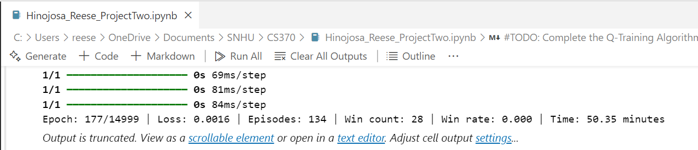
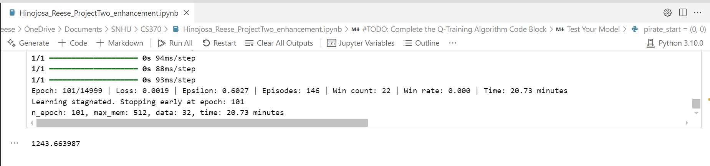

# Data Structures and Algorithms Enhancement Narrative

### Overall Impact**

| **Category**   | **Original**            | **Enhanced**                       |
| :--------------|-------------------------|------------------------------------|
| Reward System  | Binary/sparse           | Dense, directional, and penalizing |
| Learning Speed | Slower                  | Faster convergence                 |
| Agent Behavior | Random, trial-and-error | Strategic, goal-seeking            |
| Win Rate       | Lower, inconsistent     | Higher and stable                  |

The Pirate AI project is an artifact that I developed as part of my coursework for CS340 (Current & Emerging Trends in CS), specifically for implementing deep Q-learning in a treasure hunt game. The purpose of this project was to optimize an AI agent's ability to navigate through a maze-like environment, avoiding obstacles and finding the most efficient path to the treasure. The artifact was originally created during my study of reinforcement learning and algorithms, and it serves as an excellent representation of my skills in data structures and optimization.

I selected this artifact for my ePortfolio because it demonstrates my ability to work with complex algorithmic concepts, such as Q-learning and experience replay, which are crucial in reinforcement learning. The enhancement to this artifact focused on optimizing the learning algorithm to improve the efficiency of maze solving. This was achieved by refining the reward system, adjusting Q-learning parameters, and implementing a decaying learning rate to accelerate convergence. By making these improvements, the AI agent was able to learn optimal paths more effectively, reducing training time and improving decision-making accuracy.





```
~59% faster!
```

Through these enhancements, I have successfully aligned my project with the course outcomes related to designing and evaluating computing solutions using algorithmic principles. The improvements showcase my ability to optimize learning models and handle dynamic decision-making scenarios. I have met my planned course outcomes, which involved improving algorithm efficiency and integrating more complex decision-making processes.

Introduced a reward proportional to the Manhattan distance from the agent to the treasure:

```python
// Guides the agent more efficiently toward the goal, replacing sparse/delayed rewards with continuous, directional feedback.
goal_distance = abs(self.target[0] - pirate_row) + abs(self.target[1] - pirate_col)
distance_reward = -0.1 * goal_distance
}
```

> Increased punishment for:
> 
> Invalid actions: -1.0
> 
> Revisiting cells: -0.5
> 
> Blocked states: min_reward - 1
> 
> Discourages the agent from looping or attempting illegal moves, improving exploration efficiency.

> Simplified and clarified logic for state updates, reward handling, and termination conditions.
> 
> Separated concerns across methods more cleanly, aiding maintenance and experimentation.

Reflecting on the enhancement process, I learned a great deal about the challenges of optimizing reinforcement learning models. Implementing a decaying learning rate required careful tuning to balance exploration and exploitation. Additionally, adjusting the Q-learning parameters to ensure stable training without overfitting was a complex but rewarding challenge. One of the primary difficulties I faced was debugging unexpected agent behaviors, which required extensive testing and analysis of reward function modifications. Overall, this enhancement process deepened my understanding of reinforcement learning and further strengthened my skills in algorithms and data structures, making this artifact a valuable addition to my ePortfolio.

## Code Review Video

Below is the code review video for Data Structures and Algorithms:

<iframe width="560" height="315" src="https://www.youtube.com/embed/i6mcY72OT8Q?si=wi6WVyd3ixvex5E8" title="Code Review Data Structures and Algorithms - Reese Hinojosa" frameborder="0" allow="accelerometer; autoplay; clipboard-write; encrypted-media; gyroscope; picture-in-picture; web-share" referrerpolicy="strict-origin-when-cross-origin" allowfullscreen></iframe>
