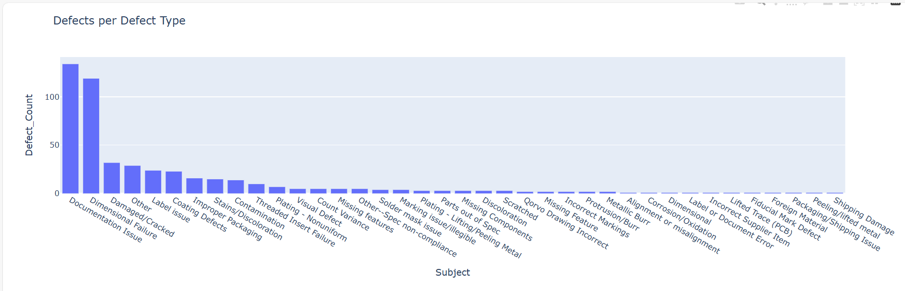

# Databases Enhancement Narrative

For my artifact in the databases category, I selected an interactive Defect Analysis Dashboard that evolved from an Excel-based defect tracking spreadsheet. This original artifact was created during my work in quality control, where I regularly analyze production defect data to identify trends and support process improvement. The original Excel file included structured data and basic visualizations to report defect frequency. However, while useful, the spreadsheet lacked scalability, real-time updates, and the ability to interactively filter or explore the data in a more meaningful way. As part of my enhancement plan, I migrated the data from Excel to a MongoDB database and built a web-based dashboard using Python’s Dash framework, providing a dynamic and user-friendly interface for analyzing quality metrics.

I chose to include this enhanced artifact in my ePortfolio because it directly demonstrates my ability to transform a real-world, static analysis tool into a scalable, interactive, and automated dashboard solution. It showcases multiple technical skills, including database integration, data analysis, and modern web-based visualization. The dashboard connects to MongoDB and uses aggregation queries to group defect records by manufacturer. It visualizes the data with Plotly in a responsive bar chart and provides a foundation for implementing additional filters for defect severity, type, and date ranges. This artifact highlights my competency in creating database-backed applications and shows how I can apply classroom learning in a real industrial context, making it a strong representation of my database and development skills.

<iframe width="560" height="315" src="https://www.youtube.com/embed/pG7DjiKv020?si=4sXKvHsNhe6Mr60S" title="Databases - Reese Hinojosa" frameborder="0" allow="accelerometer; autoplay; clipboard-write; encrypted-media; gyroscope; picture-in-picture; web-share" referrerpolicy="strict-origin-when-cross-origin" allowfullscreen></iframe>

This enhancement clearly aligns with multiple course outcomes from the CS 499 curriculum. Specifically, I have demonstrated my ability to design and evaluate computing solutions using algorithmic principles by replacing manual data tracking with an automated dashboard. I also employed innovative tools and techniques in computing practice by integrating MongoDB, Dash, and Plotly to create a modern and maintainable application. Furthermore, this artifact supports organizational decision-making, as the dashboard allows engineers and quality teams to monitor production defects in real time and take prompt corrective actions. These achievements align with course outcomes related to database management, data processing, visualization, and using computing tools to deliver value in professional settings.

Through the process of enhancing this artifact, I gained valuable hands-on experience with data ingestion, database design, and web-based visualization. One of the biggest learning moments was converting flat Excel data into structured documents for MongoDB, which required cleaning and normalizing the data to ensure consistency and performance. I also deepened my understanding of query optimization, as I had to design aggregation pipelines that retrieved relevant insights efficiently. Building the dashboard layout and adding interactivity through Dash gave me new insight into user interface design and the importance of usability in analytical tools. I faced several challenges along the way, including handling missing data, ensuring data types were compatible across systems, and managing performance as the data volume grew. These experiences not only strengthened my technical skills but also helped me think more critically about the end-user experience and the impact of real-time data access in decision-making environments.

Overall, this artifact reflects a complete transformation from a basic spreadsheet into a scalable, interactive defect analysis system that I would be confident using in a professional manufacturing or engineering setting. It connects directly to my current role in quality engineering and aligns well with my career goal of becoming a data science engineer specializing in quality automation and process improvement. The skills I developed while enhancing this artifact, including data modeling, visualization, real-time interactivity, and automation—are directly applicable to the challenges I aim to solve in the industry. As I continue developing the dashboard to include advanced filters and automated reporting, I will further reinforce my alignment with the course outcomes and continue building toward a well-rounded, industry-ready portfolio.

## Code Review Video

Below is the code review video for Databases:

<iframe width="560" height="315" src="https://www.youtube.com/embed/dXg7A76T2cQ?si=OCopSL4TLCvRJXZu" title="Code Review Databases - Reese Hinojosa" frameborder="0" allow="accelerometer; autoplay; clipboard-write; encrypted-media; gyroscope; picture-in-picture; web-share" referrerpolicy="strict-origin-when-cross-origin" allowfullscreen></iframe>
