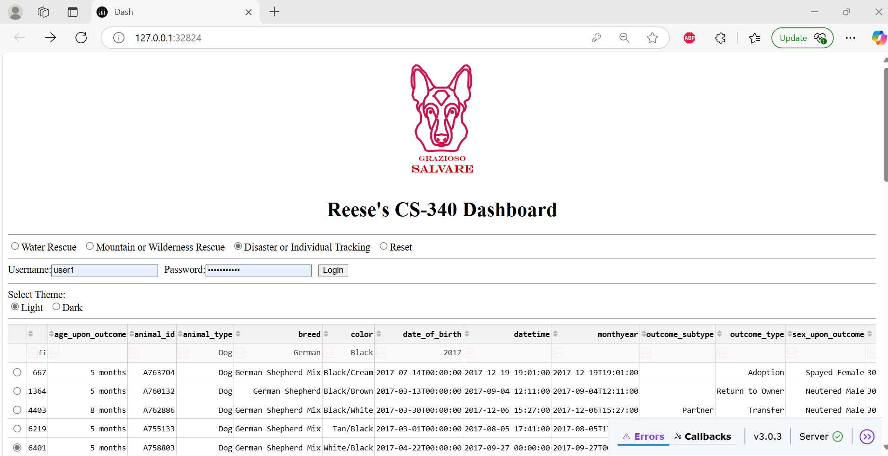

# Welcome!

[Connect with me on LinkedIn](https://www.linkedin.com/in/reese-hinojosa-5a4636287/)

[Email me](reeselegacyprep@gmail.com)

> Looking back on this project, I realize how much I've grown—not just in technical skills, but in patience, persistence, and problem-solving.
>
> Every challenge was a chance to learn, and every setback helped shape a stronger outcome.

# <u>Table of Content</u>

&nbsp;[Professional Self-Assessment](#Professional-Self-Assessment "Professional Self-Assessment") 
&nbsp;[Enhancement Plan and Code Review](#enhancement-plan-and-code-review) 
&nbsp;&nbsp;[Code Review Videos Link](#code-review-videos-link) 
&nbsp;[Software Design and Engineering](#Software-Design-and-Engineering "Software Design and Engineering") 
&nbsp;[Data Structures and Algorithms](#Data-Structures-and-Algorithms "Data Structures and Algorithms") 
&nbsp;[Databases](#Databases "Databases") 

Completing my Bachelor of Science in Computer Science has been a transformative experience, one that not only deepened my technical skillset but also helped me solidify my professional identity and goals. Through hands-on coursework, real-world-inspired projects, and the creation of this ePortfolio, I have been able to reflect on my growth, showcase my capabilities, and position myself as a competent and employable candidate in the competitive field of computer science. This portfolio serves as both a culmination of my academic journey and a launching point into my professional career, particularly as I transition into a Data Science Engineer role in the quality and manufacturing space.

Throughout the program, I’ve had the opportunity to engage in collaborative team environments, mirroring real-world development settings. In one of my software engineering courses, I worked with a group to design and implement a web application from scratch, practicing agile methodologies and version control with GitHub. This experience sharpened my ability to contribute effectively in team-based projects, prioritize tasks, and communicate technical decisions clearly. In professional settings, I’ve applied these skills to streamline quality reporting through dashboard automation and data visualization.

Communication with stakeholders has also been a core component of both my coursework and work experience. Whether it’s translating complex technical findings into actionable insights for quality engineers or presenting project updates to non-technical peers in academic settings, I’ve learned how crucial clear, audience-tailored communication is in driving project success. For example, in a course focused on human-computer interaction, I designed a user-centered plant nursery website, prioritizing accessibility and usability—an experience that deepened my understanding of end-user needs and stakeholder alignment.

My foundational understanding of data structures and algorithms was built through rigorous coursework and hands-on problem-solving. Concepts like binary trees, hash maps, and sorting algorithms have become second nature, and I’ve practiced applying them to optimize code efficiency and solve real-world problems. These fundamentals support my growing expertise in quality-focused data analysis, especially as I move toward implementing machine learning models for defect prediction.

In the realm of software engineering and databases, I’ve developed and deployed full-stack applications using technologies like Angular, Express, and MongoDB. In one key project, I migrated defect data from Excel into MongoDB and built an interactive dashboard using Dash and Plotly. This not only enhanced performance and scalability but also modernized how quality metrics are tracked and analyzed. Through this process, I gained a strong appreciation for designing reliable database schemas, building RESTful APIs, and writing maintainable backend code.

Security is a vital concern in all modern software systems, and my coursework exposed me to secure coding practices, data validation, and basic encryption techniques. While I continue to deepen my understanding in this area, I approach every project with a security-first mindset, ensuring systems are built with data integrity and user privacy in mind.

The artifacts in this portfolio reflect my broad skill set and my focus on practical, impactful computing solutions. They range from interactive dashboards that analyze manufacturing defect trends to responsive websites designed with accessibility in mind. Together, they highlight my ability to apply computer science principles in diverse contexts, spanning front-end and back-end development, data management, and user-centered design.

Each artifact was selected not only for its technical merit but also for how it aligns with my long-term professional goals: to bridge the gap between data and decision-making in the manufacturing and semiconductor industries. Whether it’s streamlining quality reporting or preparing for advanced machine learning applications, these projects demonstrate my readiness to contribute meaningfully to any data-driven or software-focused team.

As a soon-to-be graduate, I am confident that the combination of my academic training, real-world project experience, and continuous learning mindset will allow me to thrive in the evolving field of computer science.

### Professional Skillset

| #### **Hard Skills**                | #### **Soft Skills**                        |
|:------------------------------------|:--------------------------------------------|
| Python                              | Analytical thinking and problem-solving     |
| Dash and Plotly                     | Attention to detail                         |
| Pandas & NumPy                      | Communication                               |
| MongoDB                             | Collaboration and cross-functional teamwork |
| SQL                                 | Adaptability                                |
| JavaScript / Angular                | Time management                             |
| RESTful APIs                        | Initiative                                  |
| HTML/CSS                            | Continuous learning and self-improvement    |
| Data visualization                  | Empathy and user-centered design thinking   |
| Git & GitHub                        | Critical thinking                           |
| Excel                               | Leadership                                  |
| Quality control data analysis       |                                             |
| Reort automation tools and workflows|                                             |

    <a href="#">
        <button style="font-size: 10px; font-weight: 500; background: #4169e1; color: #ffffff; border-radius: 50px; border-style: solid; border-color: #4169e1; padding: 5px 8px;">Back to Top &#8593;</button>
    </a>

## Enhancement Plan and Code Review

Code review is a systematic examination of source code by developers to identify bugs, ensure adherence to coding standards, improve code maintainability, and enhance overall software quality. It is a collaborative process where peers evaluate each other’s code to provide constructive feedback and suggest improvements.

Code review is essential for computer science professionals because it helps prevent defects from reaching production, improving software reliability and security. It also promotes knowledge sharing among team members, as developers learn from each other’s coding practices and techniques. Additionally, code reviews enforce consistency in coding style and best practices, making codebases easier to maintain and scale.

According to the OWASP Code Review Guide and Pluralsight’s code review checklist, several best practices are essential for effective code reviews. One of the most critical aspects is checking for security vulnerabilities, such as SQL injection or improper authentication handling, to ensure secure coding practices are followed. Additionally, reviewers should assess code readability and maintainability by verifying that naming conventions are clear and consistent, complexity is minimized, and relevant comments are included. It is also important to validate the functionality and correctness of the code to confirm that it meets the intended requirements and behaves as expected. Adhering to established coding standards and style guides helps maintain consistency across the codebase, making it easier for teams to collaborate and maintain the software over time. Furthermore, fostering a culture of constructive feedback during code reviews encourages continuous learning and professional growth, rather than criticism. Ideally, code reviews should be conducted before merging changes into the main branch. This timing helps catch issues early, prevent the accumulation of technical debt, and ensure that only high-quality, well-tested code is integrated into the project, ultimately reducing future debugging and refactoring efforts.

My code review will focus on three key categories: Software Engineering and Design, Algorithms and Data Structures, and Databases. For each category, I will describe the existing functionality, apply a checklist to analyze the code, and propose enhancements to improve quality, performance, and security.

In the Software Engineering and Design category, I will begin by outlining the software's purpose, its core features, and any design patterns implemented. The code review will assess the structure of the code to ensure it is modular and maintainable. I will also examine the clarity of documentation and the meaningfulness of variable names, ensuring that they accurately reflect their purpose. Additionally, I will look for signs of defensive programming, such as proper error handling and mitigation of potential security risks. Based on the analysis, I will recommend enhancements such as refactoring the code to improve modularity, adding exception handling mechanisms, improving logging practices for better debugging, and enhancing documentation to support long-term maintainability.

For the Algorithms and Data Structures category, I will describe the intended function of the algorithm, the types of data structures used, and the expected output. The review will include an analysis of the algorithm’s efficiency, with a focus on time complexity and the optimization of loops or recursive processes. I will also evaluate the code for secure input handling and the presence of tests that cover various edge cases. Enhancements in this area will include optimizing the algorithm to improve performance, implementing caching strategies where applicable, and adding unit tests to ensure reliability and correctness under different input scenarios.

In the Databases category, I will explain the current database structure, the types of queries used, and the relationships among tables. The review will examine the database’s structural integrity, ensuring proper normalization and the use of efficient indexing to support performance. I will also assess security practices, such as protection against SQL injection, and evaluate the overall efficiency of query operations. To enhance this aspect of the system, I will suggest optimizing the schema design, implementing parameterized queries to prevent injection attacks, and refining indexing strategies to improve query performance.

Overall, this structured review approach will help identify strengths and areas for improvement in each domain, leading to a more secure, efficient, and maintainable software solution.

	

    <a href="#">
        <button style="font-size: 10px; font-weight: 500; background: #4169e1; color: #ffffff; border-radius: 50px; border-style: solid; border-color: #4169e1; padding: 5px 8px;">Back to Top &#8593;</button>
    </a>

Writing maintainable, readable, and adaptable programs requires careful planning, modular design, and adherence to coding standards. In Project One, the CRUD Python module was designed with reusability in mind. The use of clean function definitions, clear documentation, and consistent naming conventions made the code easy to understand and extend. For example, each CRUD operation (Create, Read, Update, Delete) was implemented as an independent function, allowing for quick debugging and adaptation to new requirements. Working this way offers significant advantages, such as making it easier to connect the dashboard widgets to the database in Project Two. This modularity reduces redundancy and allows for efficient data management and visualization. In the future, this CRUD Python module could be reused in other projects requiring database interactions, such as building an inventory management system or automating data processing tasks.

As a computer scientist, problem-solving involves breaking down the problem into manageable components, identifying key requirements, and leveraging appropriate tools or techniques to build a solution. For the Grazioso Salvare project, I started by analyzing the database schema and dashboard requirements. I used an iterative development process, where I first implemented basic CRUD operations and then integrated those operations with the dashboard. This approach differed from previous assignments because it involved connecting multiple layers: a database (MongoDB), Python middleware (CRUD module), and a visualization layer (Dash/Plotly). I also employed debugging techniques such as logging and testing individual modules to ensure seamless integration. In the future, I would adopt a similar systematic approach while also prioritizing user feedback to refine features and meet client needs effectively.

Computer scientists solve complex problems by designing algorithms, creating systems, and building tools that improve efficiency, productivity, and decision-making. This work is essential in enabling organizations to harness technology for better outcomes. For a company like Grazioso Salvare, my work on the dashboard and database can streamline their operations, providing quick and accurate insights into animal shelter data. For instance, they can identify trends in animal intake or visualize breed distributions, enabling better resource allocation and decision-making. Such tools improve operational efficiency and contribute to the company’s broader mission of animal welfare. By delivering functional, user-friendly solutions, computer scientists help organizations achieve their goals more effectively.

---

[Software Design and Engineering Enhancement](./software-design-and-engineering.html)

---

    <a href="#">
        <button style="font-size: 10px; font-weight: 500; background: #4169e1; color: #ffffff; border-radius: 50px; border-style: solid; border-color: #4169e1; padding: 5px 8px;">Back to Top &#8593;</button>
    </a>

For this project, I was provided with starter code that set up the game environment and some basic functionality for the treasure hunt game. My primary task was to implement a deep Q-learning algorithm to train the pirate agent to navigate the environment and find the treasure before the human player.

I developed the reinforcement learning model by creating a neural network that approximates Q-values, allowing the agent to make decisions about which path to take. I implemented key techniques like experience replay to prevent overfitting and target networks to stabilize the training process. The core of my work focused on balancing exploration and exploitation to optimize the agent’s pathfinding ability. Through iterative training, I fine-tuned the agent's strategy to ensure it learned to avoid obstacles and find the treasure efficiently.

A key challenge in this project was ensuring that the agent could learn to adapt to new environments and obstacles, which I addressed by using techniques like epsilon-greedy exploration. This allowed the agent to explore new strategies early on, but gradually shift toward exploiting learned behaviors as training progressed.

As a result, I was able to create an intelligent agent that could effectively navigate the maze-like environment and consistently find the treasure, demonstrating the power of deep Q-learning for pathfinding in AI.

Computer scientists develop algorithms and systems to solve complex problems, such as pathfinding in games or data analysis. Their work underpins technology we use daily, from AI in gaming to self-driving cars, and has widespread implications for automation, security, and efficiency.

As a computer scientist, I first break down the problem into smaller, manageable components, such as the goal of pathfinding or decision-making. I then apply methods such as algorithm design, data analysis, and machine learning to address the challenge. In this case, I utilized deep Q-learning, balancing exploration and exploitation to efficiently solve the pathfinding problem.

Ethical responsibilities include ensuring fairness, transparency, and privacy in AI applications. For the game, I must ensure that the agent behaves in a fair and predictable way, avoiding making the game unfairly difficult. Furthermore, I am responsible for the integrity of the code, ensuring it functions as intended without causing harm or unintended consequences.

---

[Data Structures and Algorithms](./data-structures-and-algorithms.html)

---

    <a href="#">
        <button style="font-size: 10px; font-weight: 500; background: #4169e1; color: #ffffff; border-radius: 50px; border-style: solid; border-color: #4169e1; padding: 5px 8px;">Back to Top &#8593;</button>
    </a>

The Excel spreadsheet from the DMR (Discrepant Material Report) system is used to track, document, and analyze product defects found during quality control processes. It typically includes fields such as defect type, quantity, lot number, description, part manufacturer, and open/closed date. This spreadsheet serves as a centralized record that helps teams monitor trends, prioritize issues, and drive improvements.

To create a DMR, the process generally starts with identifying and recording a defect during inspection. The relevant details are entered into the system, including who discovered the issue, when and where it occurred, and pictures and documentation provided when applicable. Once documented, the issue is reviewed by Engineering, and a disposition is conducted. From there, actions are defined, implemented, and tracked within the DMR before and after resolution.

Advantages of using the Excel-based DMR system include ease of use, accessibility, and flexibility. Most users are already familiar with Excel, which makes adoption simple. It also allows for quick sorting and filtering of data. However, disadvantages include limited scalability, risk of data entry errors, lack of real-time collaboration, and challenges in maintaining version control when multiple people are editing.

In the future, the DMR system could evolve by integrating with automated data collection tools or dashboards. With added analytics or machine learning, it could even predict defect trends or automatically flag high-risk processes, further improving quality and efficiency.

As a computer scientist, I approach problems methodically by first understanding the full scope of the problem, gathering requirements, and identifying constraints before diving into a solution. When our company requested a database and dashboard to support quality control efforts, I began by collaborating with stakeholders to clarify what data needed to be tracked, how it was currently being managed, and what insights they hoped to gain. This requirement-gathering phase was crucial to ensure the solution would align with real-world needs rather than just academic scenarios.

Compared to previous assignments in other courses, this project felt more grounded in practical application. While coursework often focused on theoretical concepts or isolated features, this project required me to design a system that integrated multiple technologies (like a CSV dataset, Dash for the dashboard, and potentially MongoDB or local storage). It also pushed me to consider performance, user experience, and real-time interaction—all essential in a real-world environment but not always emphasized in class projects.

For future projects, I would continue to use a client-centered design approach: starting with user interviews, creating mockups or wireframes, and iterating based on feedback. I would also implement strategies such as data modeling (ERDs), schema validation, and indexing early on to ensure scalability and efficiency. Additionally, I plan to leverage version control, modular code structure, and documentation practices to make the system maintainable and collaborative. Ultimately, balancing technical precision with user needs is what transforms a good solution into a great one.

My work on this type of project can help a company streamline operations, improve decision-making, and enhance overall quality management. By developing a custom database and dashboard tailored to your processes, I can provide a centralized, organized view of key quality control data. This allows your team to quickly identify defect trends, monitor performance across different lines or shifts, and take proactive measures to reduce scrap or rework.

Instead of manually searching through spreadsheets or relying on scattered reports, the dashboard offers real-time insights and visualizations that support faster, data-driven decisions. It can also reduce the chances of human error by automating data entry or standardizing how information is captured. Over time, this leads to more consistent reporting, improved traceability, and better accountability across teams.

In short, the tools I create aren’t just about tracking defects—they empower my company to act on quality data more effectively. That leads to cost savings, higher product reliability, and ultimately a stronger competitive edge. As our processes evolve, these systems can also scale and adapt, making them long-term assets rather than short-term solutions.

---

[Databases](./databases.html)

---

    <a href="#">
        <button style="font-size: 10px; font-weight: 500; background: #4169e1; color: #ffffff; border-radius: 50px; border-style: solid; border-color: #4169e1; padding: 5px 8px;">Back to Top &#8593;</button>
    </a>

