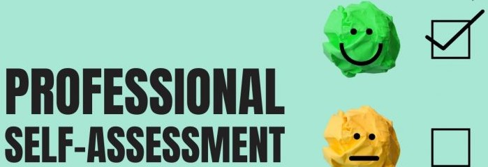
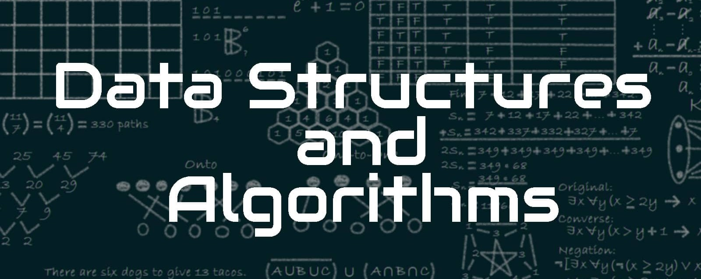

# Welcome!

[Connect with me on LinkedIn](https://www.linkedin.com/in/reese-hinojosa-5a4636287/)

[Link to another page](./another-page.html).

# <u>Table of Content</u>

&nbsp;[Professional Self-Assessment](#self-assessment "Professional Self-Assessment")<br/>
&nbsp;&nbsp;&nbsp;&nbsp;- [Enhancement Plan and Code Review](#enhancement-plan-and-code-review)<br/>
&nbsp;&nbsp;&nbsp;&nbsp;&nbsp;&nbsp;&nbsp;- [Code Review Videos Link](#code-review-videos-link)<br/>
&nbsp;[Software Design and Engineering](#software-engineering "software-engineering")<br/>
&nbsp;&nbsp;&nbsp;&nbsp;- [Data Structures and Algorithms](#ds-and-a "ds-and-a")<br/>
&nbsp;&nbsp;&nbsp;&nbsp;- [Database](#database "database")<br/>



Completing my Bachelor of Science in Computer Science has been a transformative experience, one that not only deepened my technical skillset but also helped me solidify my professional identity and goals. Through hands-on coursework, real-world-inspired projects, and the creation of this ePortfolio, I have been able to reflect on my growth, showcase my capabilities, and position myself as a competent and employable candidate in the competitive field of computer science. This portfolio serves as both a culmination of my academic journey and a launching point into my professional career, particularly as I transition into a Data Science Engineer role in the quality and manufacturing space.

Throughout the program, I’ve had the opportunity to engage in collaborative team environments, mirroring real-world development settings. In one of my software engineering courses, I worked with a group to design and implement a web application from scratch, practicing agile methodologies and version control with GitHub. This experience sharpened my ability to contribute effectively in team-based projects, prioritize tasks, and communicate technical decisions clearly. In professional settings, I’ve applied these skills to streamline quality reporting through dashboard automation and data visualization.

Communication with stakeholders has also been a core component of both my coursework and work experience. Whether it’s translating complex technical findings into actionable insights for quality engineers or presenting project updates to non-technical peers in academic settings, I’ve learned how crucial clear, audience-tailored communication is in driving project success. For example, in a course focused on human-computer interaction, I designed a user-centered plant nursery website, prioritizing accessibility and usability—an experience that deepened my understanding of end-user needs and stakeholder alignment.


My foundational understanding of data structures and algorithms was built through rigorous coursework and hands-on problem-solving. Concepts like binary trees, hash maps, and sorting algorithms have become second nature, and I’ve practiced applying them to optimize code efficiency and solve real-world problems. These fundamentals support my growing expertise in quality-focused data analysis, especially as I move toward implementing machine learning models for defect prediction.

In the realm of software engineering and databases, I’ve developed and deployed full-stack applications using technologies like Angular, Express, and MongoDB. In one key project, I migrated defect data from Excel into MongoDB and built an interactive dashboard using Dash and Plotly. This not only enhanced performance and scalability but also modernized how quality metrics are tracked and analyzed. Through this process, I gained a strong appreciation for designing reliable database schemas, building RESTful APIs, and writing maintainable backend code.

Security is a vital concern in all modern software systems, and my coursework exposed me to secure coding practices, data validation, and basic encryption techniques. While I continue to deepen my understanding in this area, I approach every project with a security-first mindset, ensuring systems are built with data integrity and user privacy in mind.

The artifacts in this portfolio reflect my broad skill set and my focus on practical, impactful computing solutions. They range from interactive dashboards that analyze manufacturing defect trends to responsive websites designed with accessibility in mind. Together, they highlight my ability to apply computer science principles in diverse contexts, spanning front-end and back-end development, data management, and user-centered design.

Each artifact was selected not only for its technical merit but also for how it aligns with my long-term professional goals: to bridge the gap between data and decision-making in the manufacturing and semiconductor industries. Whether it’s streamlining quality reporting or preparing for advanced machine learning applications, these projects demonstrate my readiness to contribute meaningfully to any data-driven or software-focused team.

As a soon-to-be graduate, I am confident that the combination of my academic training, real-world project experience, and continuous learning mindset will allow me to thrive in the evolving field of computer science.

###### Professional Skillset

| Hard Skills                         | Soft Skills                                 |
|:------------------------------------|:--------------------------------------------|
| Python                              | Analytical thinking and problem-solving     |
| Dash and Plotly                     | Attention to detail                         |
| Pandas & NumPy                      | Communication                               |
| MongoDB                             | Collaboration and cross-functional teamwork |
| SQL                                 | Adaptability                                |
| JavaScript / Angular                | Time management                             |
| RESTful APIs                        | Initiative                                  |
| HTML/CSS                            | Continuous learning and self-improvement    |
| Data visualization                  | Empathy and user-centered design thinking   |
| Git & GitHub                        | Critical thinking                           |
| Excel                               | Leadership                                  |
| Quality control data analysis       |                                             |
| Reort automation tools and workflows|                                             |

<div style="text-align: right;">
    <a href="#">
        <button style="font-size: 10px; font-weight: 500; background: #4169e1; color: #ffffff; border-radius: 50px; border-style: solid; border-color: #4169e1; padding: 5px 8px;">Back to Top &#8593;</button>
    </a>
</div>

## Enhancement Plan and Code Review

<div style="text-align: center;">
	<a href="CodeReview" title="Artifacts Code Review">
		
	</a>
</div>


---

[Software Design and Engineering](./software-design-and-engineering.html)

---

<div style="text-align: right;">
    <a href="#">
        <button style="font-size: 10px; font-weight: 500; background: #4169e1; color: #ffffff; border-radius: 50px; border-style: solid; border-color: #4169e1; padding: 5px 8px;">Back to Top &#8593;</button>
    </a>
</div>




> This is a blockquote following a header.
>
> When something is important enough, you do it even if the odds are not in your favor.

```js
// Javascript code with syntax highlighting.
var fun = function lang(l) {
  dateformat.i18n = require('./lang/' + l)
  return true;
}
```

### There's a horizontal rule below this.

* * *

### Small image


### Large image


```
Long, single-line code blocks should not wrap. They should horizontally scroll if they are too long. This line should be long enough to demonstrate this.
```

```
The final element.
```

<div style="text-align: right;">
    <a href="#">
        <button style="font-size: 10px; font-weight: 500; background: #4169e1; color: #ffffff; border-radius: 50px; border-style: solid; border-color: #4169e1; padding: 5px 8px;">Back to Top &#8593;</button>
    </a>
</div>
